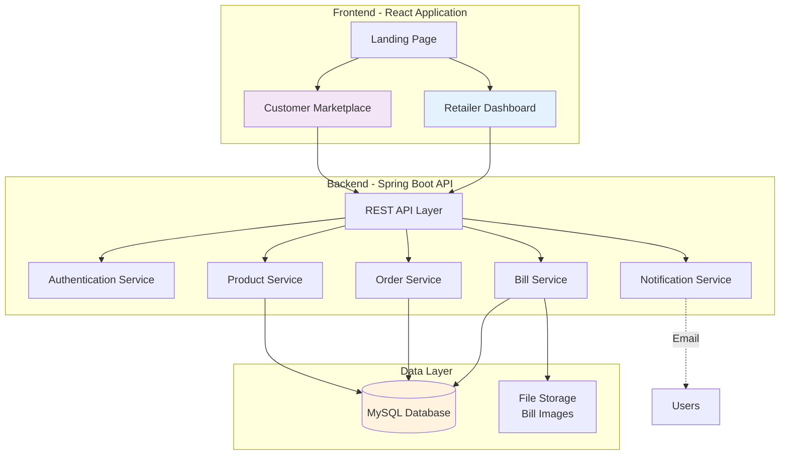
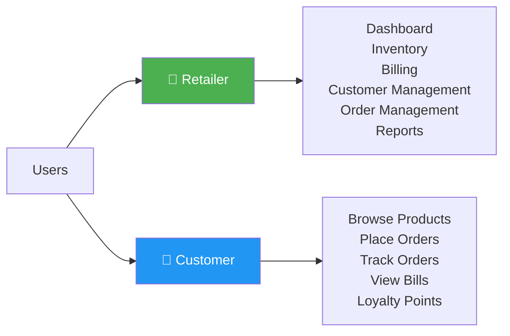
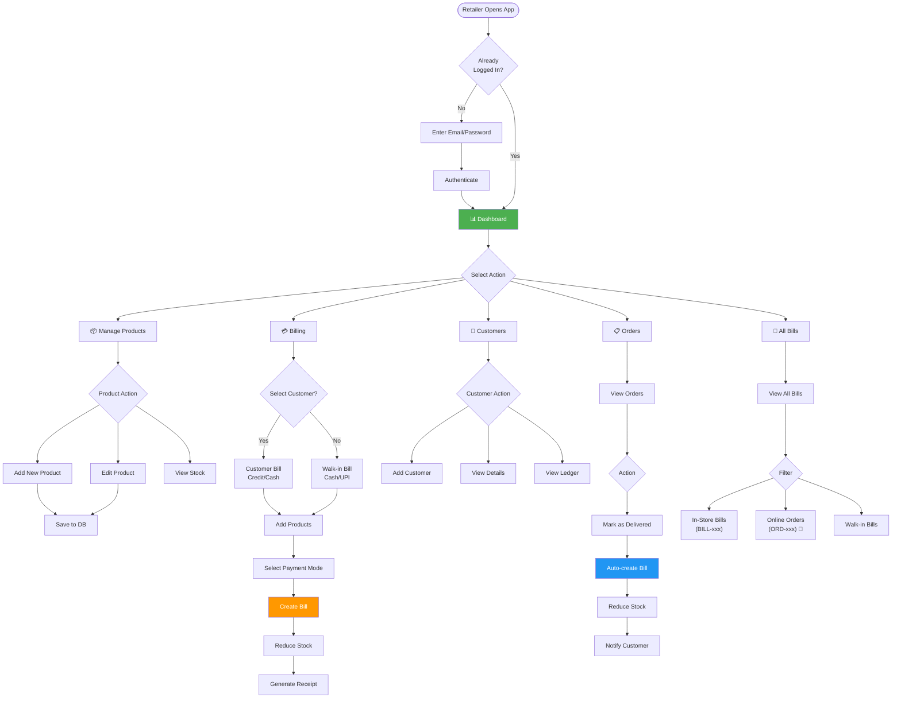
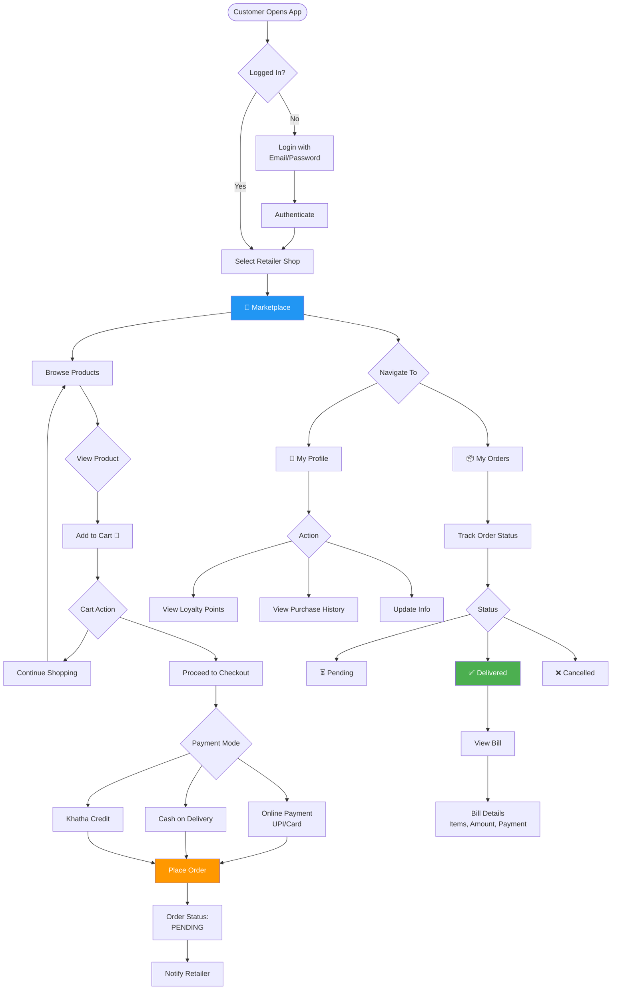
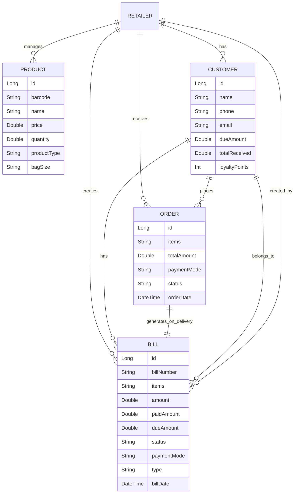
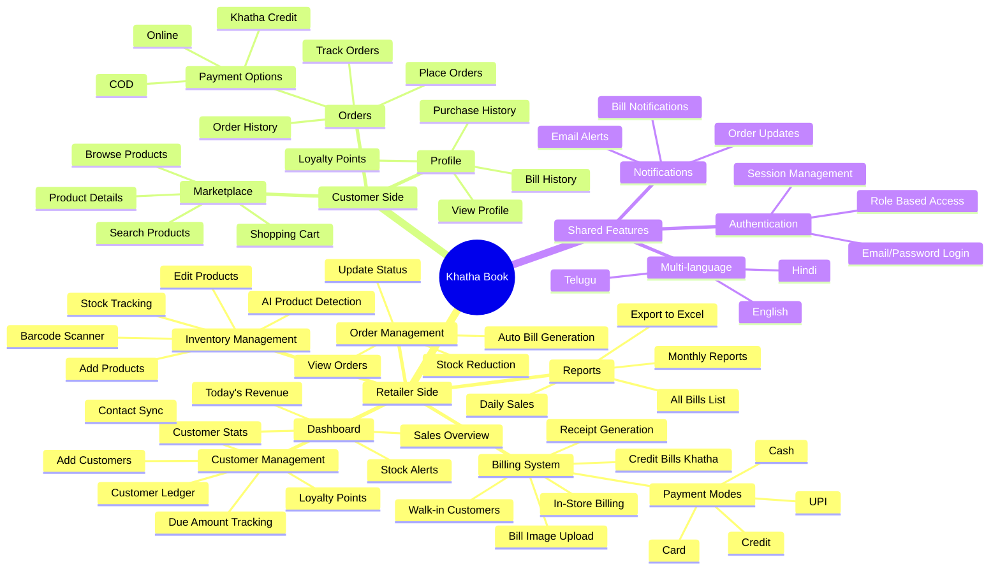
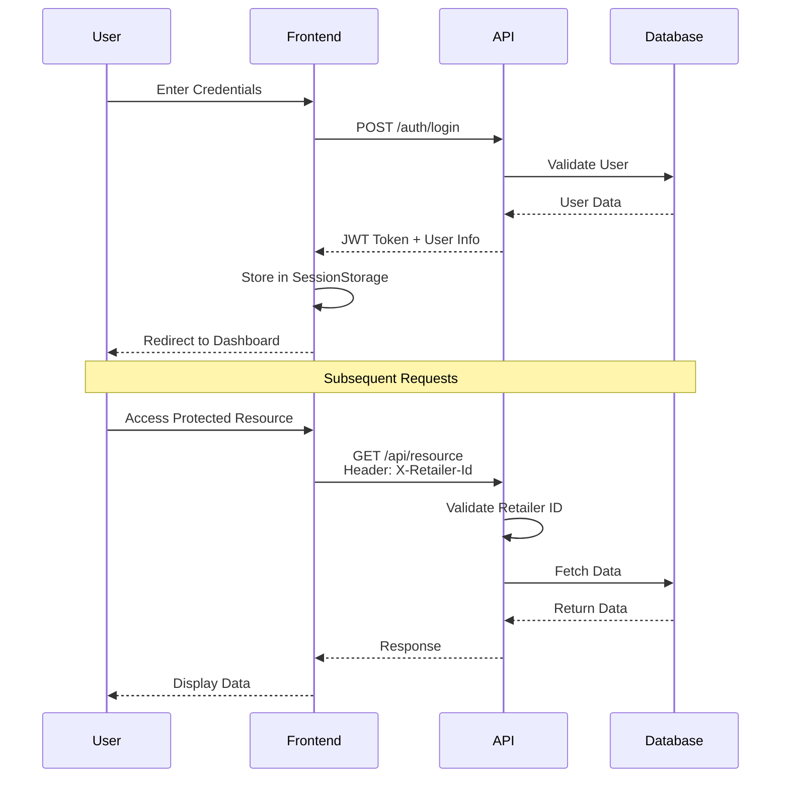
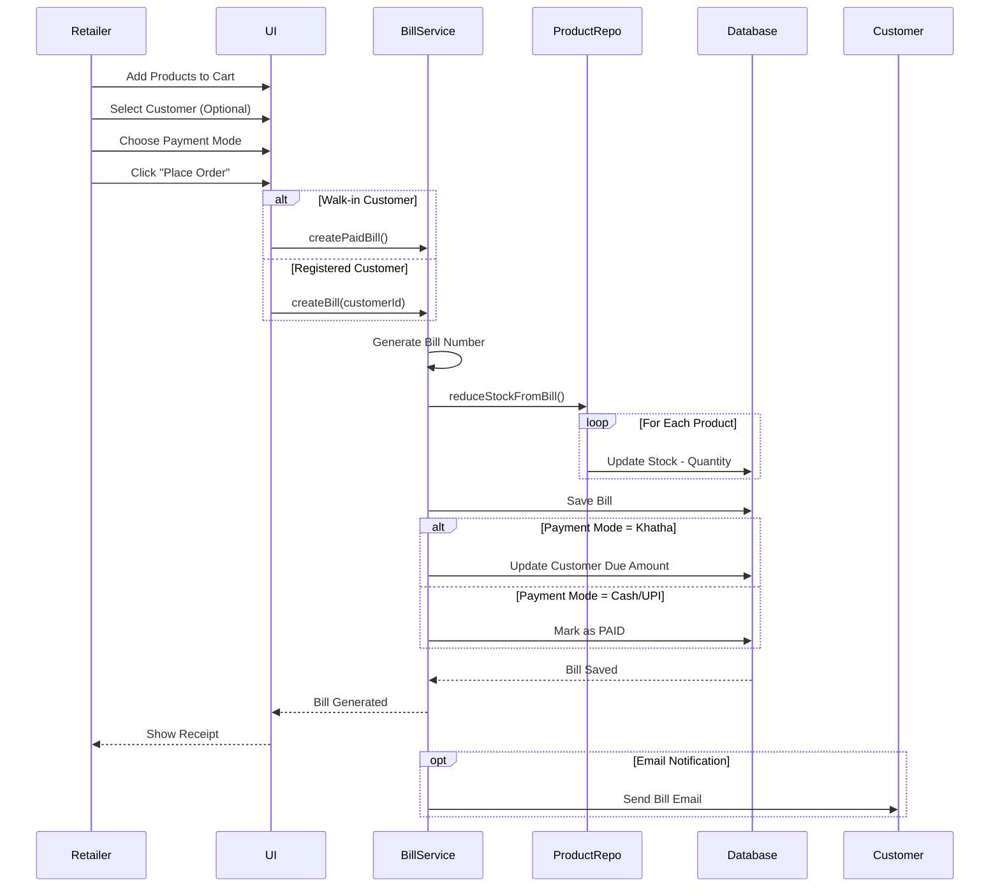
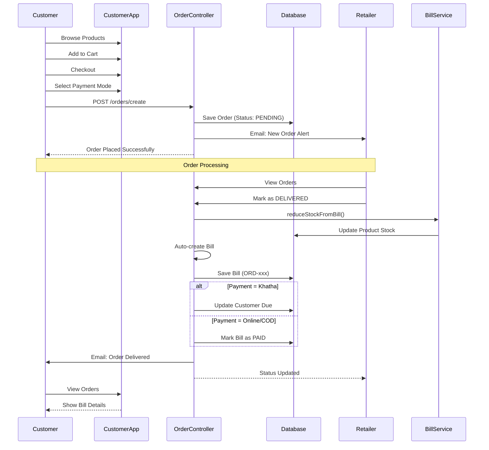

# Khatha Book - Website Blueprint & Flowcharts

## System Overview

**Khatha Book** is a comprehensive business management application for retailers with integrated customer-facing e-commerce features. It combines inventory management, billing, credit tracking (Khatha), and online ordering capabilities.

---

## 🏗️ System Architecture

---

## 👤 User Types & Access

---

## 🔄 Retailer User Flow

---

## 🛒 Customer User Flow

---

## 💾 Data Flow & Relationships

---

## 🎯 Core Features Module Map

---

## 🔐 Authentication & Authorization Flow

---

## 📦 Billing Process Flow

---

## 🛍️ Online Order Process Flow

---

## 📊 Key Application Screens

### Retailer Dashboard
- **Sales Overview**: Today's sales, weekly trends
- **Quick Stats**: Total customers, pending orders, low stock alerts
- **Recent Activity**: Latest bills, orders, customer additions

### Products Module
- **Product List**: Grid/List view with stock levels
- **Add/Edit Product**: Barcode, name, price, quantity, type (Weight/Liquid/Unit)
- **Stock Management**: Real-time stock tracking with alerts
- **AI Scanner**: Camera-based product detection and auto-fill

### Billing Module  
- **Product Selection**: Search or scan barcode
- **Cart**: Quantity adjustment, remove items
- **Customer Selection**: Optional for loyalty/credit
- **Payment**: Cash, UPI, Card, Khatha (Credit)
- **Receipt**: Print or email bill

### Customer Management
- **Customer List**: Search, filter, sort
- **Customer Details**: Contact info, ledger, bills history
- **Ledger**: Credit/debit transactions, payments
- **Loyalty**: Points earned, redeemed

### Order Management (Retailer)
- **Order List**: Filter by status (Pending/Delivered/Cancelled)
- **Order Details**: Items, customer, payment mode
- **Actions**: Mark as delivered, update status
- **Auto-billing**: Bills generated on delivery with stock reduction

### All Bills
- **Bill List**: All transactions (in-store + online)
- **Filters**: Date range, customer, payment mode, status
- **Indicators**: 
  - Walk-in badge for bills without customer
  - 🛒 Online Order badge for bills from orders (ORD-xxx)
- **Export**: Download as Excel/CSV

### Customer Marketplace
- **Product Grid**: Browse retailer's catalog
- **Search/Filter**: Find products quickly
- **Product Card**: Image, price, add to cart
- **Cart**: Review items, proceed to checkout

### Customer Orders
- **Order History**: All past orders
- **Order Status**: Pending, Delivered, Cancelled
- **Track Order**: Real-time status updates
- **View Bill**: Detailed bill for delivered orders

### Customer Profile
- **Personal Info**: Name, email, phone
- **Loyalty Points**: Points balance, earn/redeem history
- **Purchase History**: All bills and orders
- **Due Amount**: Outstanding credit balance

---

## 🛠️ Technology Stack

### Frontend
- **Framework**: React 18
- **Build Tool**: Vite
- **Styling**: CSS (Vanilla CSS with custom properties)
- **Icons**: Lucide React
- **Routing**: React Router
- **State**: React Hooks (useState, useEffect)
- **API Client**: Axios

### Backend
- **Framework**: Spring Boot 3.x
- **Language**: Java 21
- **Database**: MySQL
- **ORM**: JPA/Hibernate
- **Build Tool**: Maven
- **Authentication**: Session-based with headers

### Features
- **Barcode Scanning**: Browser Camera API
- **AI Product Detection**: Image recognition
- **Email Notifications**: Spring Mail
- **File Upload**: Multipart file handling
- **Internationalization**: i18n (React i18next)

---

## 🎨 Design Highlights

- **Responsive**: Mobile-first design, works on all devices
- **Modern UI**: Clean, intuitive interface
- **Dark Mode**: System preference detection
- **Accessibility**: Semantic HTML, keyboard navigation
- **Performance**: Lazy loading, code splitting
- **PWA Ready**: Can be installed as mobile app

---

## 📱 Mobile Features

- **Bottom Navigation**: Easy thumb access on mobile
- **Swipe Actions**: Swipe to delete cart items
- **Touch-optimized**: Large tap targets
- **Scanner**: Camera integration for barcode scanning
- **Responsive Cards**: Adapted layouts for small screens

---

## 🔔 Notification System

- **Email Notifications**:
  - New order alerts to retailer
  - Order status updates to customer
  - Bill generation confirmations
- **Toast Notifications**: In-app success/error messages
- **Real-time Updates**: Automatic data refresh

---

## 🚀 Unique Features

1. **Khatha (Credit) System**: Traditional Indian accounting for credit sales
2. **Loyalty Points**: Earn on purchases, redeem for discounts
3. **Dual Interface**: Separate retailer and customer apps in one platform
4. **Stock Deduction**: Automatic inventory updates on billing
5. **Multi-payment**: Support for Cash, UPI, Card, and Credit
6. **AI Product Scan**: Smart product recognition from images
7. **Order-to-Bill**: Seamless conversion of orders to bills
8. **Walk-in Support**: Quick billing without customer registration
9. **Export Reports**: Excel export for accounting
10. **Multi-language**: Support for regional languages

---

This blueprint provides a comprehensive overview of the Khatha Book application architecture, user flows, and features. The system is designed to bridge traditional retail practices with modern e-commerce capabilities.
